# SDLC Workflows

> Domain reference for planning future core plugins. This document does NOT define the Bazaar's own development process — it maps the SDLC domain that core plugins will encode as skills, hooks, and agents.

**Purpose:** This document maps standard software development workflows as the domain model for the Bazaar's core plugins. Each workflow identifies the agent roles, decision points, and reusable sub-flows that plugins encode as skills, hooks, agents, MCP servers, and LSP servers. Plugin specs reference this document rather than duplicating its analysis.

**Status:** Draft

---

## Workflow Catalog

| Workflow              | Description                                              | Frequency  | Status                       |
| --------------------- | -------------------------------------------------------- | ---------- | ---------------------------- |
| New Project Setup     | Greenfield scaffold, configure, establish patterns       | Rare       | Mapped                       |
| New Feature           | Full cycle: plan → decompose → implement → verify → docs | Common     | Mapped                       |
| Extend/Modify Feature | Change existing behavior, has prior context              | Common     | Mapped                       |
| Bug Fix               | Diagnose → fix → regression test                         | Common     | Mapped                       |
| Refactoring           | Improve code without behavior change                     | Occasional | See Story Cycle, Maintenance |
| Spike/Exploration     | Research before committing to approach                   | Occasional | Mapped                       |
| Maintenance           | Dependency updates, cleanup, security patches            | Periodic   | Mapped                       |
| Documentation         | Standalone doc work (not tied to feature)                | Occasional | Mapped                       |
| Infrastructure Change | CI/CD, deployment config, environment setup              | Occasional | Mapped                       |
| Release / Deployment  | Prepare and ship a release                               | Periodic   | Mapped                       |
| Incident Response     | Production incident, fast diagnosis and fix              | Rare       | Mapped                       |
| Audit                 | Security audit, performance review, code quality sweep   | Periodic   | Mapped                       |
| Retrospective         | Team reflection, process improvement                     | Periodic   | Mapped                       |
| Onboarding            | New project context, getting oriented                    | Rare       | Mapped                       |

---

## Sub-flows

Reusable building blocks composed by main workflows.

### Review Gate

Quality check before merge. Used by Story Cycle and Infra Cycle.

**Agents:** Code Reviewer (primary), Architect (contributor for design/security concerns)

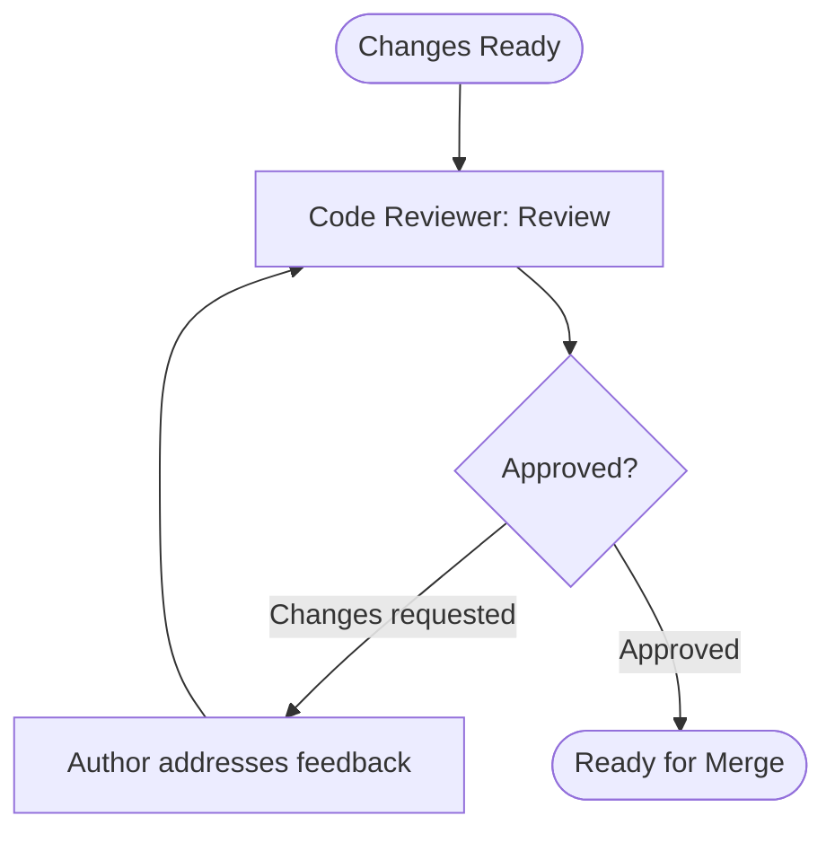

---

### Three Amigos

Planning ceremony for shared understanding.

**Agents:** Business Analyst (leads), Software Engineer, Test Engineer, Architect (always present, chooses engagement level)

**Output:** Refined acceptance criteria, edge cases, escalation flag

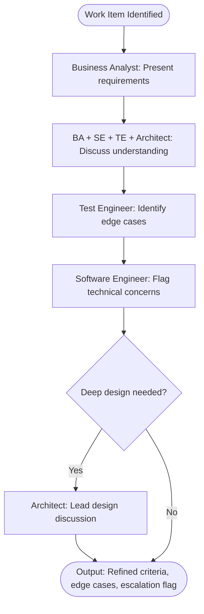

---

### Decomposition

Break approved scope into trackable issues.

**Agents:** Business Analyst (stories), Architect (technical tasks), Software Engineer (technical tasks), Test Engineer (testing tasks)

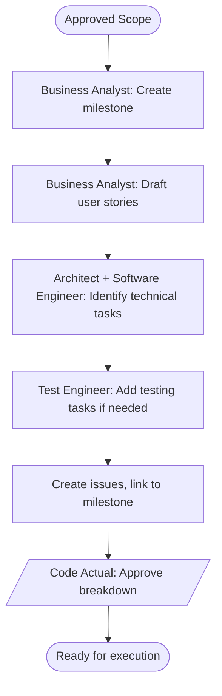

---

### Story Cycle

Implement a single issue from start to merge. Includes TDD's red-green-refactor.

**Agents:** Software Engineer, Test Engineer (if integration tests needed), Code Reviewer

**Assumes:** 1 Issue = 1 PR

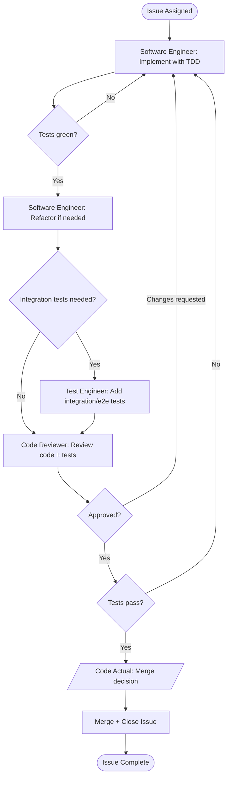

---

### Infra Cycle

Implement and deploy infrastructure changes.

**Agents:** DevSecOps Engineer (primary), Architect (design review), Code Reviewer (code quality)

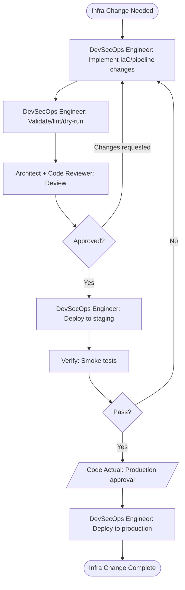

---

### Doc Update

Create or update documentation.

**Agents:** Technical Writer (primary), Business Analyst (requirements accuracy), Software Engineer or Architect (technical accuracy), Document Reviewer (quality review)

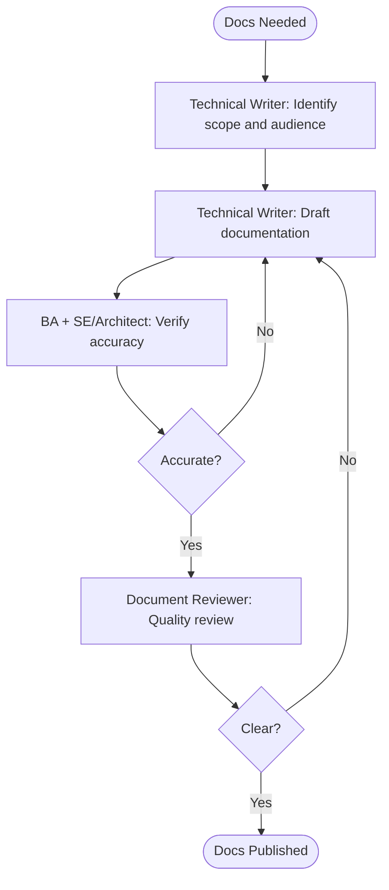

---

### Discovery

Understand current state before proposing changes. Used when modifying existing behavior.

**Agents:** Business Analyst (spec), Software Engineer (code), Test Engineer (coverage), Architect (if cross-cutting)

**Output:** Current state summary, dependencies identified, regression risk areas flagged

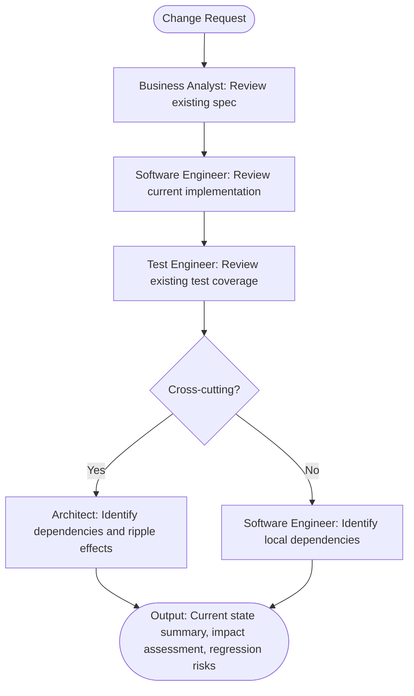

---

## Mapped Workflows

### New Feature

**When:** Code Actual requests new functionality
**Frequency:** Common

#### Agents Involved

- **Business Analyst** — Requirements, spec, stories, acceptance criteria
- **Architect** — (if escalated) Architectural guidance, ADRs, technical tasks
- **Software Engineer** — Technical tasks, implementation with TDD
- **Test Engineer** — Edge cases, integration/e2e tests, testing tasks
- **Code Reviewer** — Quality gate
- **DevSecOps Engineer** — (if infra needed) Pipeline or environment changes
- **Technical Writer** — (if user-facing) Documentation updates

#### Flow

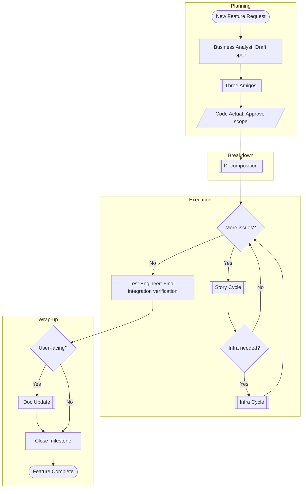

#### Code Actual Checkpoints

- After Three Amigos → approve scope before decomposition
- After Decomposition → approve breakdown and sequencing
- Per Story Cycle → merge decision for each issue
- Per Infra Cycle → production deployment approval (if applicable)

#### Key Points

- **Spec before code** — Business Analyst drafts spec during Planning
- **Three Amigos required** — Shared understanding before decomposition
- **One Issue = One PR** — Per Story Cycle convention
- **User-facing = docs** — Technical Writer updates docs at wrap-up

#### Variations

- **Small feature:** Skip Decomposition if it's genuinely one story
- **API change:** Architect involved from Planning, not just on escalation
- **Infra-heavy feature:** DevSecOps Engineer joins Three Amigos

---

### Extend/Modify Feature

**When:** Code Actual requests changes to existing functionality
**Frequency:** Common

#### Agents Involved

- **Business Analyst** — Spec review, spec updates, stories
- **Architect** — (if cross-cutting) Impact assessment, ADRs if patterns change
- **Software Engineer** — Code review, implementation, local impact assessment
- **Test Engineer** — Coverage review, regression risks, integration/e2e tests
- **Code Reviewer** — Quality gate
- **DevSecOps Engineer** — (if infra affected) Pipeline or environment changes
- **Technical Writer** — (if user-facing) Documentation updates

#### Flow

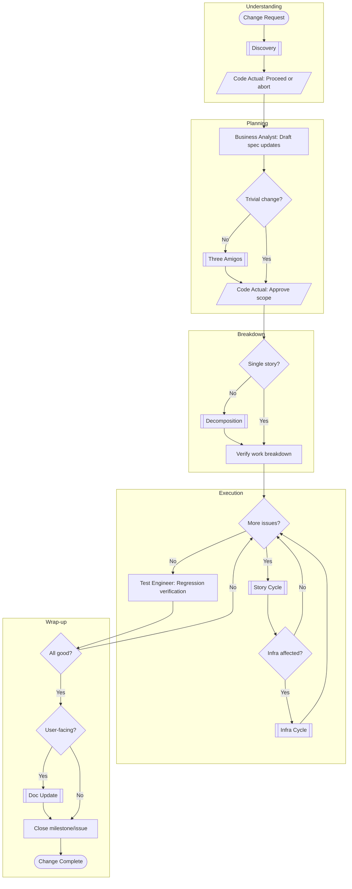

#### Code Actual Checkpoints

- After Discovery → decide whether to proceed (impact might be too high)
- After Planning → approve scope
- After Decomposition → approve breakdown (if applicable)
- Per Story Cycle → merge decision for each issue
- Per Infra Cycle → production deployment approval (if applicable)

#### Key Points

- **Discovery first** — Understand current state before proposing changes
- **Abort option** — Discovery may reveal change isn't worth impact
- **Regression focus** — Test Engineer verifies existing behavior preserved
- **Delta specs** — Update existing specs, don't create new ones

#### Key Differences from New Feature

- **Discovery phase** — Must understand current state before planning
- **Spec updates** — Delta changes, not new spec creation
- **Regression verification** — Explicit step to verify existing behavior preserved
- **Abort option** — Discovery might reveal the change isn't worth the impact

#### Variations

- **Trivial change:** Skip Three Amigos if change is obviously contained
- **Breaking change:** Architect involved throughout, may need ADR for migration strategy
- **Deprecation:** Business Analyst documents sunset plan, Technical Writer updates migration guides

---

### Bug Fix

**When:** Post-merge defect reported or discovered
**Frequency:** Common

**Scope:** Defects in merged code. Bugs found during active development are fixed inline as part of Story Cycle.

#### Agents Involved

- **Business Analyst** — Triage (user-facing severity), acceptance criteria for fix
- **Software Engineer** — Triage (technical assessment), diagnosis, fix implementation
- **Test Engineer** — Verify fix, add regression test
- **Code Reviewer** — Quality gate (always)
- **Architect** — (if systemic) Root cause reveals architectural issue

#### Flow

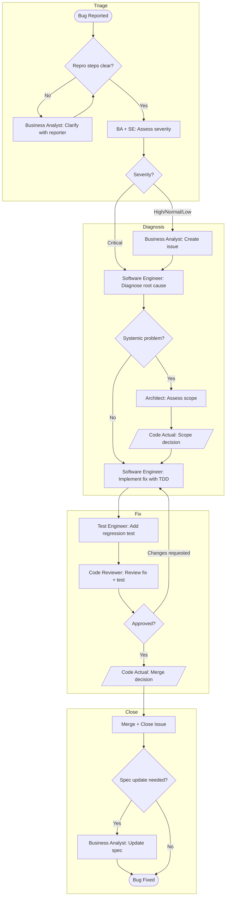

#### Code Actual Checkpoints

- After Architect assessment (if systemic) → decide scope of fix
- After Code Review → merge decision

#### Severity Handling

| Severity | Issue first?   | Notes                                   |
| -------- | -------------- | --------------------------------------- |
| Critical | No — fix first | Create issue retroactively for tracking |
| High     | Yes            | Prioritize immediately                  |
| Normal   | Yes            | Standard queue                          |
| Low      | Yes            | Backlog                                 |

#### Key Points

- **No Three Amigos** — Bugs have clear acceptance criteria: "it should work"
- **No Decomposition** — Single issue. If diagnosis reveals bigger problems, escalate to Code Actual
- **Regression test required** — Per Definition of Done for bugs
- **Spec update** — If the bug revealed a spec gap, fix the spec too

#### Variations

- **Critical/production:** Skip issue creation, fix immediately, document retroactively
- **Systemic issue:** May spawn Refactoring or Maintenance workflow after immediate fix
- **Flaky test:** Test Engineer owns diagnosis, not Software Engineer

---

### Spike/Exploration

**When:** Uncertainty needs resolution before committing to an approach
**Frequency:** Occasional

**Output:** Knowledge, not production code. May produce throwaway prototypes.

#### Agents Involved

- **Architect** — Design spikes, evaluating architectural options
- **Software Engineer** — Technical feasibility spikes
- **Test Engineer** — (if relevant) Testability exploration
- **DevSecOps Engineer** — (if relevant) Infra/deployment exploration

#### Flow

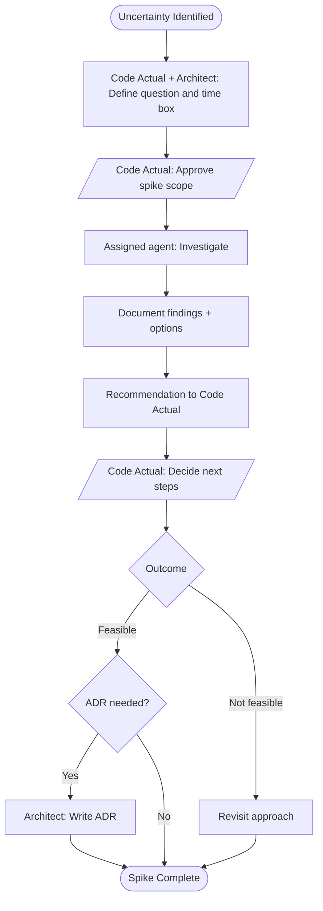

#### Code Actual Checkpoints

- Before spike → approve scope and time box
- After findings → decide next steps (proceed, pivot, or abandon)

#### Key Points

- **Time-boxed** — Fixed duration, not open-ended research
- **No code review** — Prototype code is throwaway
- **No tests** — It's exploratory
- **ADR if significant** — Capture the decision for future reference

#### Variations

- **Library evaluation:** Software Engineer compares options, documents trade-offs
- **Architecture spike:** Architect explores design approaches, may involve multiple agents
- **Vendor evaluation:** May involve external research, demos, proof of concept

---

### Maintenance

**When:** Periodic maintenance cycle or triggered by vulnerability report
**Frequency:** Periodic

**Output:** Prioritized Issues for maintenance work

#### Agents Involved

- **DevSecOps Engineer** — Dependency audit, security scan, infra health
- **Software Engineer** — Code quality audit, TODO/FIXME review
- **Test Engineer** — Test health, flaky test identification, coverage gaps
- **Architect** — Pattern compliance, structural concerns
- **Code Reviewer** — (optional) Quick code smell survey

#### Flow

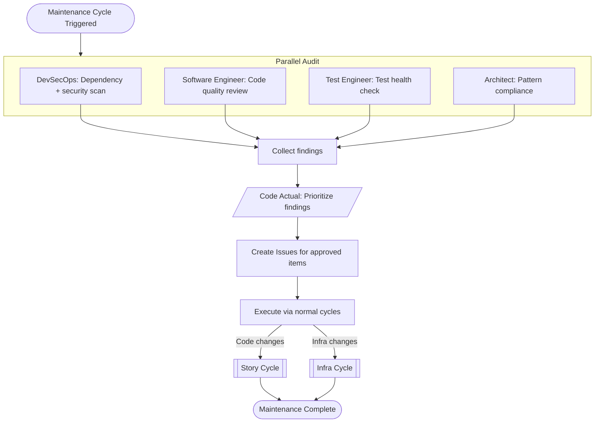

#### Code Actual Checkpoints

- After audit → prioritize what gets addressed this cycle
- Per Issue → normal merge decisions via Story/Infra Cycle

#### Key Points

- **Discovery-focused** — Main job is surfacing and organizing work
- **Batched execution** — Multiple small Issues, worked in sequence
- **Lower ceremony** — No spec, no Three Amigos (work is well-defined)
- **Escalation** — If audit reveals big problems, escalate before creating Issues

#### Variations

- **Security-triggered:** Vulnerability report triggers immediate audit of affected area
- **Pre-feature cleanup:** Targeted audit before starting major new work
- **Scheduled:** Regular cadence (monthly, quarterly) for proactive hygiene
- **Process-triggered:** Retro findings spawn maintenance work

---

### Documentation (Standalone)

**When:** Doc work not tied to a specific feature
**Frequency:** Occasional

**Scope:** Creating new docs or overhauling existing docs as an independent initiative. For docs accompanying features, use Doc Update sub-flow.

#### Agents Involved

- **Technical Writer** — Primary owner, drafting, structure
- **Business Analyst** — User-facing accuracy, requirements docs
- **Architect** — Technical accuracy for architecture docs
- **Software Engineer** — Technical accuracy for implementation docs
- **DevSecOps Engineer** — Infra/ops docs
- **Document Reviewer** — Quality review before publishing

#### Flow

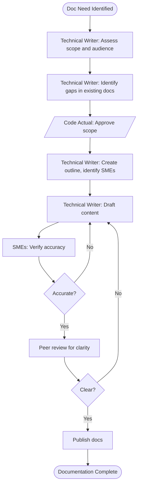

#### Code Actual Checkpoints

- After scoping → approve scope and priority

#### Key Points

- **Audience-first** — Define who the docs are for before writing
- **SME involvement** — Right experts verify right sections
- **Iterative** — Draft → review → refine cycle

#### Variations

- **Onboarding docs:** Heavy BA + Architect involvement for system overview
- **API reference:** Software Engineer as primary SME
- **Runbooks:** DevSecOps Engineer as primary author, Technical Writer polishes

---

### Infrastructure Change

**When:** Standalone infra work not tied to a specific feature
**Frequency:** Occasional

**Scope:** CI/CD changes, environment setup, cloud resources, monitoring. For infra work supporting a feature, use Infra Cycle sub-flow within the feature workflow.

#### Agents Involved

- **DevSecOps Engineer** — Primary owner, implementation
- **Architect** — Design review, patterns, ADR if needed
- **Software Engineer** — (if app changes needed) Config, environment variables
- **Technical Writer** — Runbooks, setup guides

#### Flow

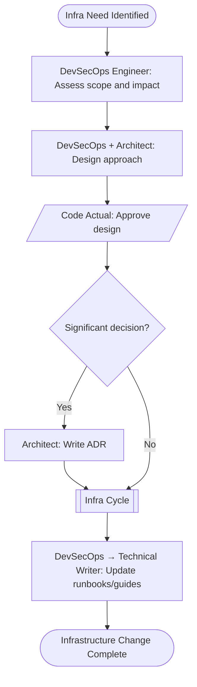

#### Code Actual Checkpoints

- After design → approve design and approach
- Within Infra Cycle → production deployment approval

#### Key Points

- **Planning upfront** — Scope and design before implementation
- **ADR for significant choices** — Capture decisions that are hard to reverse
- **Infra Cycle handles execution** — Validate, review, stage, prod
- **Documentation required** — Runbooks and setup guides updated

#### Variations

- **New environment:** Heavy planning, likely ADR, full documentation
- **Pipeline optimization:** Lighter planning, may skip ADR
- **Migration:** Phased approach, rollback plan critical

---

### Release / Deployment

**When:** Ready to ship a release
**Frequency:** Periodic

**Scope:** Versioning, changelog, deployment, verification. May include multiple merged features/fixes.

#### Agents Involved

- **DevSecOps Engineer** — Build, deploy, verify infrastructure
- **Business Analyst** — Release notes (user-facing changes)
- **Technical Writer** — Polish release notes, update docs
- **Test Engineer** — Smoke tests, post-deploy verification
- **Architect** — (if needed) Verify architectural integrity

#### Flow

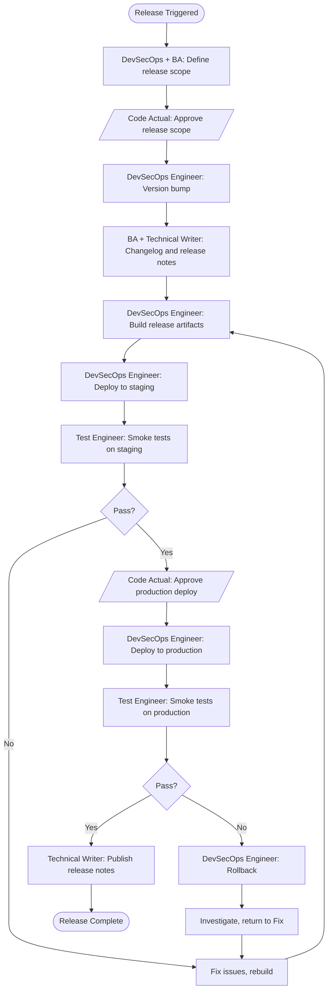

#### Code Actual Checkpoints

- Before release → approve scope (what's shipping)
- Before production → approve production deployment

#### Key Points

- **Staged rollout** — Always staging before production
- **Rollback plan** — Must have a way back if production fails
- **Verification required** — Smoke tests at each stage
- **Release notes** — User-facing communication of changes

#### Variations

- **Hotfix:** Expedited path — smaller scope, faster cycle, still needs staging verification
- **Scheduled release:** Regular cadence, scope defined by what's merged
- **Feature flag release:** Deploy code dark, enable via flags separately

---

### Incident Response

**When:** Production is broken, needs immediate attention
**Frequency:** Rare

**Scope:** Stabilize production first, root cause and proper fix later. Speed over ceremony.

#### Agents Involved

- **DevSecOps Engineer** — Infra investigation, rollback, emergency deployment
- **Software Engineer** — Code investigation, hotfix
- **Test Engineer** — Verify fix works
- **Architect** — (if systemic) Broader assessment
- **Business Analyst** — Stakeholder communication, status updates

#### Flow

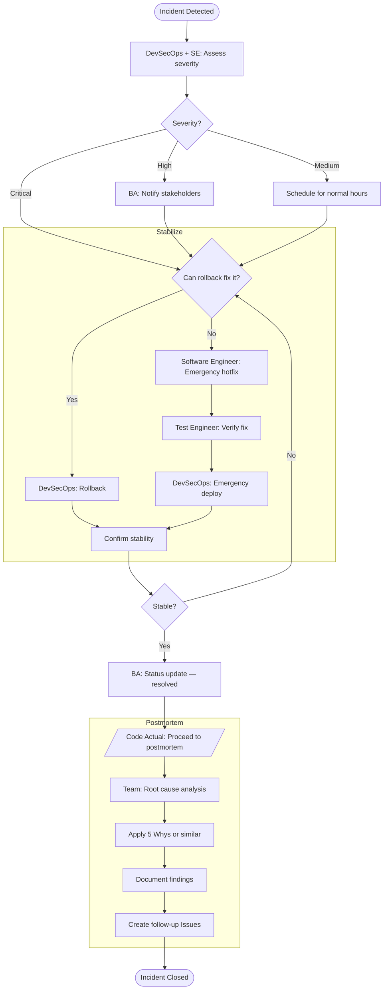

#### Code Actual Checkpoints

- After stabilization → decide when to proceed to postmortem (may need rest first)

#### Key Points

- **Stabilize first** — Get production working, proper fix comes later
- **Rollback preferred** — If rollback fixes it, do that before attempting hotfix
- **Communication** — Keep stakeholders informed throughout
- **Postmortem required** — Always understand what happened
- **5 Whys** — Or similar root cause technique to dig beyond surface symptoms
- **Follow-up Issues** — Postmortem spawns proper Bug Fix or System Story work

#### Severity Levels

| Severity | Example                                 | Response                  |
| -------- | --------------------------------------- | ------------------------- |
| Critical | System down, data loss                  | All hands, immediate      |
| High     | Major feature broken, workaround exists | Core team, urgent         |
| Medium   | Degraded performance, partial outage    | Normal hours, prioritized |

#### Variations

- **Security incident:** DevSecOps leads, may involve external notification requirements
- **Data incident:** Extra care around communication, potential compliance implications
- **Cascading failure:** Architect involved early to assess system-wide impact

---

### New Project Setup

**When:** Greenfield project initiation
**Frequency:** Rare

**Scope:** Initial repository, CI/CD, project structure, foundational ADRs, and documentation. Ends when ready for first feature work.

#### Agents Involved

| Agent              | Responsibility                                                   |
| ------------------ | ---------------------------------------------------------------- |
| Architect          | Tech selection, initial ADRs, patterns, project structure design |
| DevSecOps Engineer | Repo setup, CI/CD pipeline, dev environment, secrets management  |
| Software Engineer  | Scaffold implementation, initial code structure                  |
| Business Analyst   | Project vision doc, initial backlog/milestones                   |
| Technical Writer   | README, contributing guide, initial docs structure               |
| Test Engineer      | Test framework setup, initial test structure                     |
| Code Reviewer      | Review scaffold before approval                                  |

#### Flow

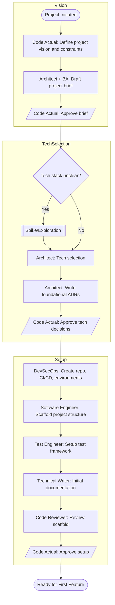

#### Code Actual Checkpoints

- After project brief → approve scope and vision
- After tech selection → approve technology choices
- After scaffold complete → approve readiness for feature work

#### Key Points

- **ADRs early** — Capture foundational decisions before code
- **Spike if needed** — Unknown tech requires exploration first
- **CI/CD from day one** — No "we'll add tests later"
- **Documentation structure** — Set up docs/, specs/, adrs/ early

#### Variations

- **Spike-first:** If tech is uncertain, run Spike workflow before full setup
- **Monorepo addition:** Lighter setup, inherit existing patterns
- **Forked/template:** Start from existing template, customize

---

### Audit

**When:** Periodic health check, compliance requirement, or triggered by concern
**Frequency:** Periodic

#### Audit Types

| Type          | Primary Agent                        | Focus                                  |
| ------------- | ------------------------------------ | -------------------------------------- |
| Security      | DevSecOps Engineer                   | Vulnerabilities, secrets, dependencies |
| Performance   | Software Engineer + Architect        | Bottlenecks, scaling concerns          |
| Code Quality  | Code Reviewer + Software Engineer    | Standards, smells, consistency         |
| Architecture  | Architect                            | Pattern drift, coupling, tech debt     |
| Test Health   | Test Engineer                        | Coverage, flakiness, gaps              |
| Accessibility | Technical Writer + Software Engineer | a11y compliance                        |
| Process       | Retro Analyst                        | Workflow efficiency, team patterns     |

#### Agents Involved

Varies by audit type. Core team:

- **DevSecOps Engineer** — Security, dependency scanning
- **Architect** — Architecture compliance, pattern review
- **Software Engineer** — Code quality, performance profiling
- **Test Engineer** — Test coverage, test health
- **Code Reviewer** — Standards enforcement, code smells
- **Retro Analyst** — Process audits, workflow efficiency

#### Flow

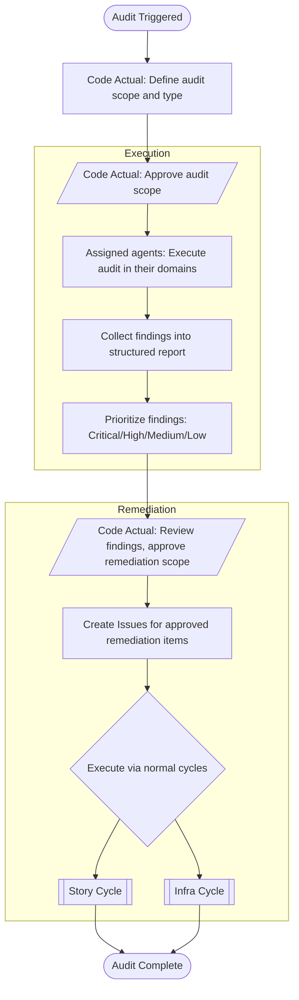

#### Code Actual Checkpoints

- Before audit → approve scope
- After findings → prioritize and approve remediation

#### Key Points

- **Scoped audits** — Don't boil the ocean; focus on specific area
- **Findings ≠ action** — Code Actual decides what gets fixed
- **Feeds other workflows** — Audit findings become Issues executed via normal workflows
- **Documented** — Audit report persisted for future reference

#### Variations

- **Compliance-driven:** External requirements dictate scope
- **Pre-release:** Quick audit before major release
- **Incident-triggered:** Post-incident audit of affected area

---

### Onboarding

**When:** New context needed — new team member, returning after break, or new project
**Frequency:** Rare

#### Onboarding Types

| Type               | Scenario                            |
| ------------------ | ----------------------------------- |
| Project onboarding | Understanding a new-to-you codebase |
| Context refresh    | Returning after extended absence    |
| New team member    | Human joining the project           |

#### Agents Involved

| Agent              | Responsibility                                     |
| ------------------ | -------------------------------------------------- |
| Architect          | Architecture overview, key ADRs, system boundaries |
| Business Analyst   | Project vision, current priorities, active work    |
| DevSecOps Engineer | Environment setup, access, tooling                 |
| Technical Writer   | Documentation gaps, reading order                  |
| Software Engineer  | Code walkthrough, patterns in use                  |

#### Flow

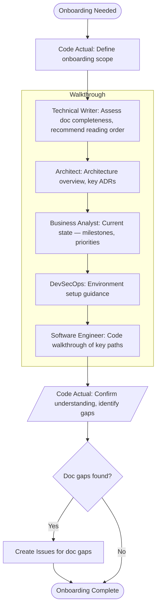

#### Code Actual Checkpoints

- After walkthrough → confirm understanding, flag remaining questions

#### Key Points

- **Reading order matters** — Don't dump everything at once
- **Active state** — What's in flight, not just architecture
- **Gaps are findings** — Missing docs discovered during onboarding become Issues
- **Interactive** — Q&A throughout, not just info dump

#### Variations

- **Self-onboarding:** Code Actual exploring new project alone
- **Area-focused:** Only need to understand one subsystem
- **Handoff:** Outgoing person transferring knowledge

---

### Retrospective

**When:** Something felt off, after a significant milestone, or periodic health check
**Frequency:** Periodic

**Scope:** Analyze recent work sessions for patterns — what's working, what's not, what to change.

#### Agents Involved

| Agent         | Responsibility                                |
| ------------- | --------------------------------------------- |
| Retro Analyst | Analyze conversation patterns, produce report |
| Code Actual   | Review findings, decide on actions            |

#### Flow

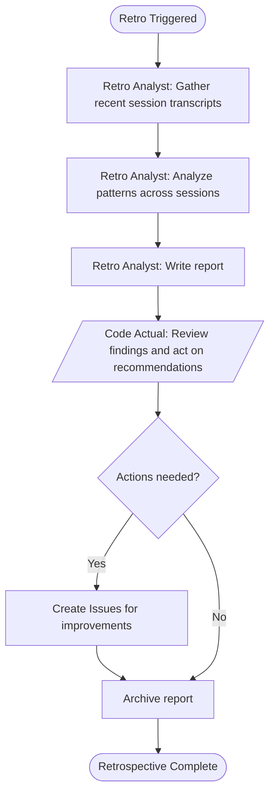

#### Categories Analyzed

- Code Actual prompting issues
- Agent-specific problems
- Process gaps
- Tool/permission problems
- Successful patterns to reinforce

#### Code Actual Checkpoints

- After report → review findings, decide what to act on

#### Key Points

- **Use sparingly** — When something felt off or periodically for health checks
- **Patterns over incidents** — Look for recurring themes, not one-off problems
- **Actions, not observations** — Every finding should suggest a concrete improvement
- **Archive processed reports** — Keep history but don't clutter active docs

#### Variations

- **Post-milestone:** After shipping a major feature or release
- **Targeted:** Focus on specific pain point (e.g., test quality, PR cycle time)
- **Periodic:** Regular cadence (monthly, quarterly)

---

## Definition of Done

Completion criteria by work item type. Referenced by workflows above.

### User Story

- [ ] Acceptance criteria met
- [ ] Tests pass (TDD default)
- [ ] Code review approved
- [ ] Spec updated
- [ ] Docs updated (if user-facing)

### System Story

- [ ] Implementation complete per spec/ADR
- [ ] Tests pass
- [ ] Code review approved
- [ ] ADR updated (if architectural)

### Bug Report

- [ ] Root cause identified
- [ ] Regression test added
- [ ] Code review approved
- [ ] Spec updated (if bug revealed spec gap)

### Research Request

- [ ] Findings documented
- [ ] Recommendation provided to Code Actual
- [ ] ADR drafted (if significant decision)

---

_All workflows accounted for. Refactoring delegates to Story Cycle and Maintenance._
